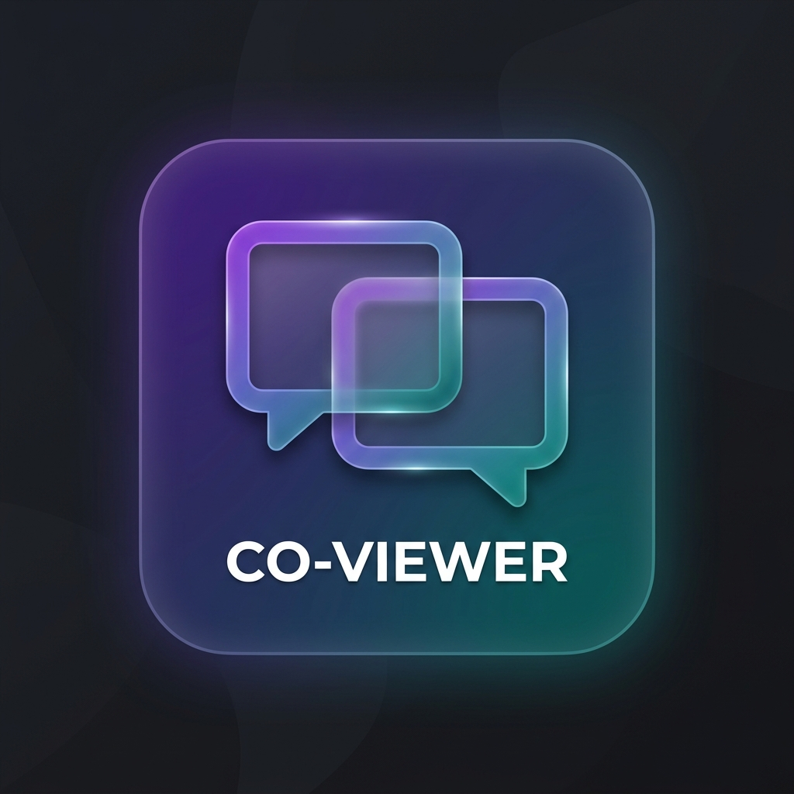

# Co-Viewer: Zero-Cost Local AI Screen Share & Chat

Co-Viewer is a privacy-focused, lightweight Chrome extension that enables peer-to-peer (P2P) screen sharing and real-time chat with a built-in AI recap feature. 

Built using the latest Chrome **Manifest V3** APIs, it leverages **Gemini Nano** for on-device AI processing and **Oracle Autonomous Database** for secure, persistent session management.



## 🚀 Features

- **P2P Screen Sharing**: Low-latency screen and tab sharing powered by WebRTC.
- **Local AI Recap**: Summarize your chat history and sessions locally on your device using Chrome's built-in **Gemini Nano** (Prompt API). No data ever leaves your machine for AI processing.
- **Encrypted Signaling**: Uses a Node.js signaling server with **Oracle Autonomous Database** (Always Free tier) for persistent session handling.
- **Voice Messages**: Record and send audio messages directly in the sidepanel.
- **AV Studio**: A dedicated standalone web portal for high-quality camera and microphone streaming, embedded via iframe.
- **Privacy First**: All media streams are peer-to-peer, and AI analysis is strictly local.

## 🛠️ Architecture

- **Extension**: Chrome Manifest V3 sidepanel application.
- **Signaling Server**: Node.js WebSocket server managing session handshakes.
- **Database**: Oracle Autonomous Database (Transaction Processing) for persisting session codes and message history.
- **AV Web App**: Standalone WebRTC portal for media handling.

## 📦 Installation (Developer Mode)

1. Clone this repository:
   ```bash
   git clone https://github.com/Ved-Dixit/co-viewer.git
   ```
2. Open Chrome and navigate to `chrome://extensions/`.
3. Enable **Developer mode** (toggle in the top-right).
4. Click **Load unpacked** and select the `extension` folder in this repository.

## ⚙️ Server Setup

1. Navigate to the `signaling-server` directory.
2. Run `npm install` to install dependencies.
3. Rename `.env.example` to `.env` and provide your Oracle Cloud credentials.
4. Initialize your database schema using the provided `init.sql`.
5. Start the server:
   ```bash
   node server.js
   ```

## 📝 Configuration

Update `extension/config.js` with your production URLs before deploying:
```javascript
const CONFIG = {
  SIGNALING_SERVER_URL: 'wss://your-hosted-server.com',
  AV_WEB_APP_URL: 'https://your-hosted-web-app.com',
};
```

## 📜 License

This project is licensed under the MIT License.
